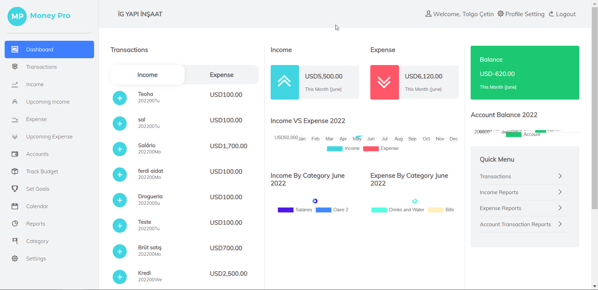
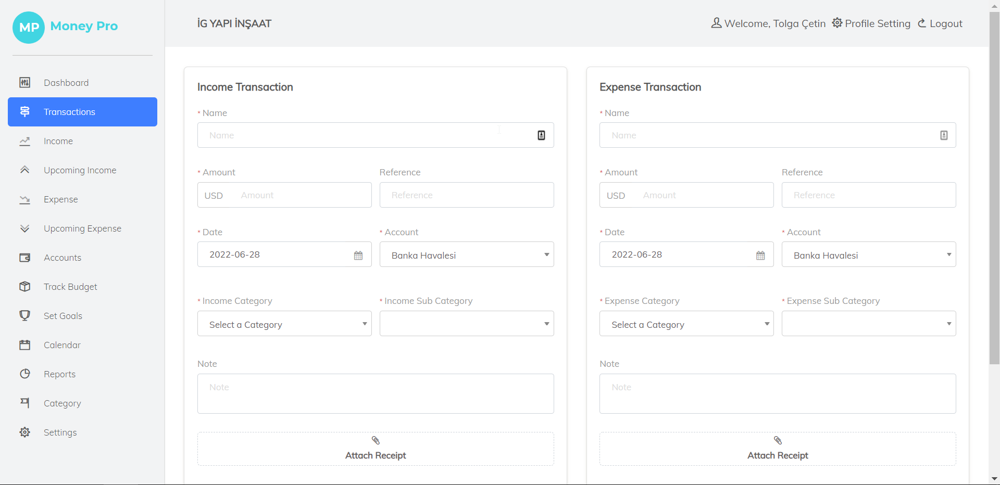
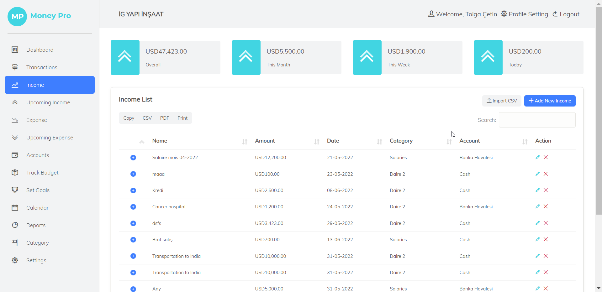
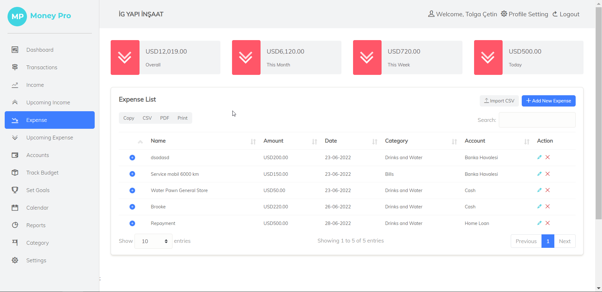
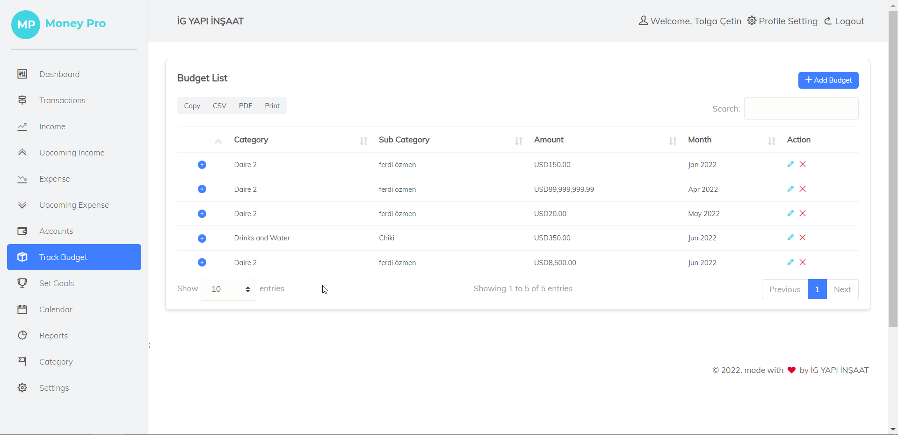
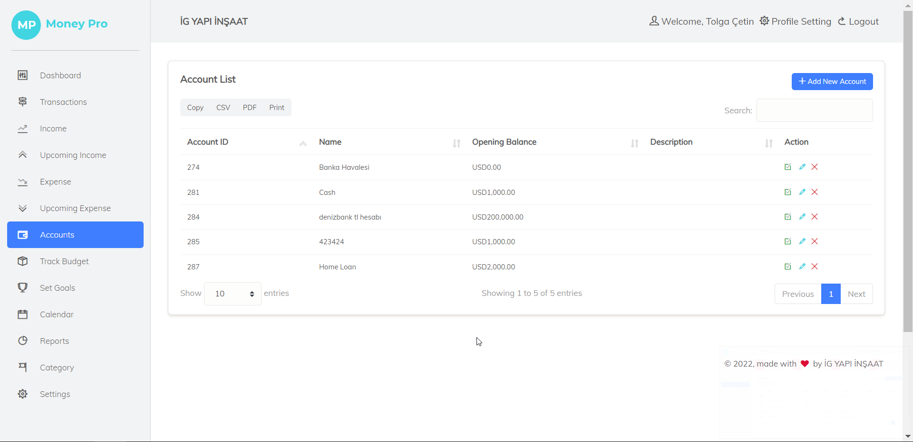
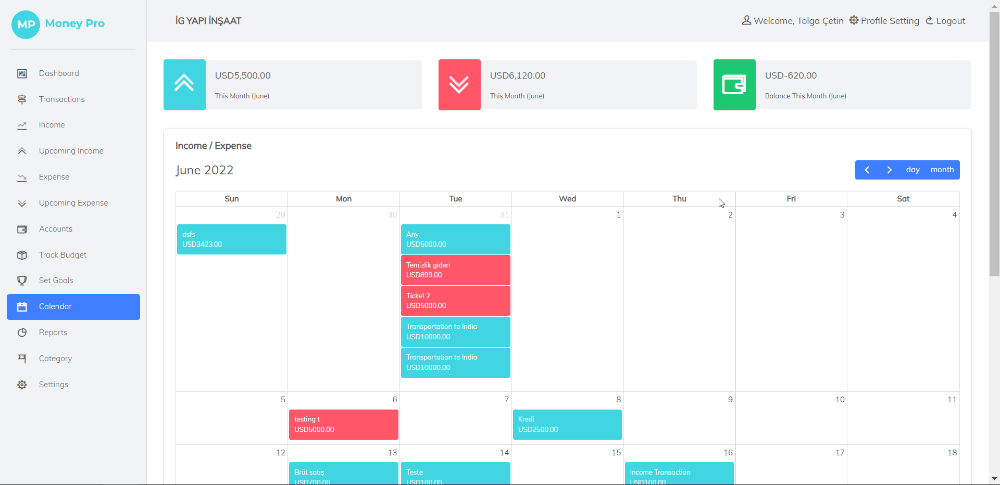
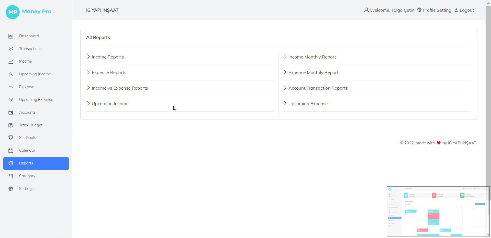
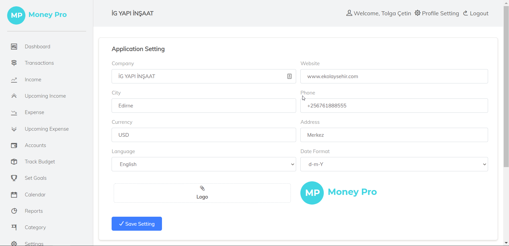
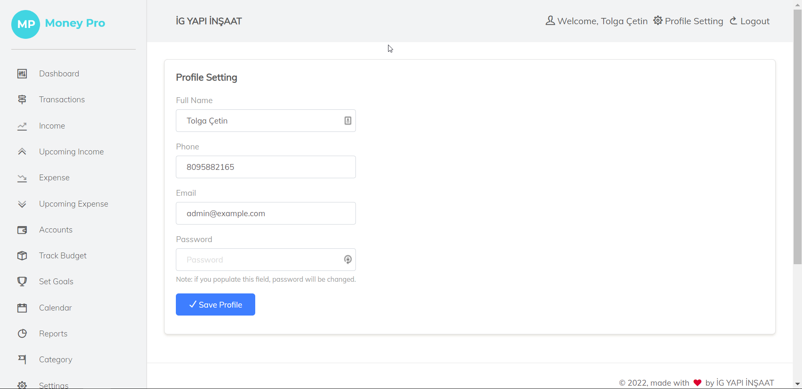

<h1 align="center">Phát triển Phần Mềm Hướng Dịch Vụ - Phần Website 
    Đề tài: Quản lý tài chính cá nhân
</h1>

    

# [**Table Of Content**](#table-of-content)
- [**Table Of Content**](#table-of-content)
- [**Introduction**](#introduction)
- [**Video**](#video)
- [**Mid-term Test**](#mid-term-test)
- [**Features**](#features)
- [**Post Script**](#post-script)
- [**Timeline**](#timeline)
  - [**Phase 1: 21-01-2022 to 27-01-2022**](#phase-1-21-01-2022-to-27-01-2022)
  - [**Phase 2: 28-01-2022 to 15-02-2022**](#phase-2-28-01-2022-to-15-02-2022)
  - [**Phase 3: 16-02-2022 to 28-02-2022**](#phase-3-16-02-2022-to-28-02-2022)
- [**Our Team**](#our-team)
- [**Made with 💘 and PHP **](#made-with--and-php-)

# [**Introduction**](#introduction)

Đây là phần tài liệu chuyên biệt để mô tả Website đã được nhóm mình xây dựng cho môn Phát Triển Phần Mềm Hướng Dịch Vụ do thầy Huỳnh Trung Trụ hướng dẫn. 
Tài liệu này mô tả phần giao diện của ứng dụng thay vì đi sâu vào mô tả chi tiết logic. Do chi tiết logic sẽ do RestfulAPI đảm nhiệm.

Website này là một thành phần để hoàn thiện đồ án môn học Phát Triển Phần Mềm Hướng Dịch Vụ. Với môn học này, sẽ có 4 thành phần chuyên biệt như sau:

- [**Restful API**](https://github.com/Phong-Kaster/PTIT-Phat-Trien-Phan-Mem-Huong-Dich-Vu-API#)

- [**Website**](https://github.com/Phong-Kaster/PTIT-Phat-Trien-Phan-Mem-Huong-Dich-Vu-Website)

- [**Android**](https://github.com/Phong-Kaster/PTIT-Phat-Trien-Ung-Dung-Di-Dong-Cuoi-Ki)

- [**iOS**](#)

# [**Video**](#video)

    

<h3 align="center">

***Xem video giới thiệu đồ án của mình luôn nè💥***
</h3>

# [**Mid-term Test**](#mid-term-test)

Nếu các bạn coi video phía trên thì có thể coi là đã coi hết tất cả các nội dung quan trọng nhất rùi😘😘. 
Tuy nhiên, trước khi được làm đồ án này thì các bạn sẽ phải vượt qua được bài kiểm tra giữa kì của môn này đã. Phần này mình sẽ 
kể nhanh một số điều các bạn cần biết thui nha.

Đại khái thì các bạn sẽ có một bài kiểm tra giữa kì sẽ kéo dài trong một tiếng đồng hồ. Sẽ có 2 đề chẵn lẻ khác nhau 
nhưng chỉ đơn thuần là đổi số liệu thôi chứ cấu trúc thì như nhau.

Bài kiểm tra gồm có 2 bài:

1. Một bài kiểm tra ngữ pháp XML(giờ học xong chữ thầy trả thầy mất rồi😪😯)

2. Một bài kiểm tra đặc tả cấu trúc dựa theo một sơ đồ cho sẵn

Đại khái thì thầy Trụ khá là dễ tính. Coi thi cũng không quá gắt. Thậm chí có đứa vắng buổi thi chính thức thầy vẫn tạo điều 
kiện cho các bạn thi lại ở buổi học sau(Dĩ nhiên là đề khác rồi nha😅). 

Điểm số thì cũng khá là xông xênh. Đại loại là nếu làm bài cần thận, trình bày đẹp thì auto 8 điểm trở lên.

Trong repository này, khi tải về các bạn sẽ thầy thư mục `document`. Thư mục này sẽ chứa đề bài và phần lời giải chính xác của mình.
Đề thi giữa kì sẽ giống y xì như đề ôn tập trong tài liệu này, khác mỗi số liệu thôi. Nên không cần quá lo lắng đâu.

Tới đây thì hết òy🥱🥱. Không còn gì đang lưu tâm nữa đâu. Xem tiếp mấy tính năng bên dưới của tớ tiếp nha.😛😛

# [**Features**](#features)

Tên đề tài dường như đã nói lên tất cả những chức năng mà các bạn có thể mường tượng ra khi nghĩa tới một ứng dụng quản lý chi tiêu cá nhân💨

Tuy nhiên, chúng mình chọn đề tài này là vì chức năng của nó sẽ không nhiều chức năng như một ứng dụng bán hàng. 
Vì môn học này là `tập trung viết ra được API` chứ không chú trọng vào tính năng cụ thể nào. 
Bản chất, môn học này `cần có nhiều ứng dụng chạy trên các nền tảng khác nhau hơn là độ phức tạp của chức năng`. 
Chỉ cần các tính năng C.R.U.D của các bạn không dính lỗi tào lao bí đao thì auto đặt yêu cầu🤩🤩

Nếu các bạn quá chú trọng vào chức năng thì sẽ tự `mua dây buộc mình`. Hồi mình học môn này, nhiều bạn chọn 
những đề tài liên quan đến thương mại điện tử dẫn đến cần nhiều thời gian để viết API và chăm chút cho các tính năng.
Nhiều nhóm mà mình biết làm từ hồi bắt đầu học (01-12-2022) tới gần thi (20-06-2022) mới xong. 
Nói chung là độ hoàn thiện về chức năng không cao như chỉ tập trung làm một website duy nhất🥱🥱

Cũng đúng thui, vì đã bao giờ sinh viên mình làm Restful API đâu ha🙄😶😑. 
Thời gian chúng ta tìm hiểu trước khi bắt tay vào làm là rất lâu. 
Nhóm mình đỡ hơn các nhóm khác do có bạn [**Nguyễn Đăng Hậu**](#our-team) đã 
có kinh nghiệm làm từ trước nên cả nhóm bắt tay vào làm sớm hơn bình thường.

Do đó, nên dành thời gian tìm hiểu dần dần từ ngay những ngày đầu học môn này luôn cho đỡ bị ngợp nhé 😜😜😜

    

<h3 align="center">

***Màn hình Dashboard🏠***
</h3>

    

<h3 align="center">

***Màn hình tạo giao dịch🗯***
</h3>

    

<h3 align="center">

***Màn hình các giao dịch thu nhập✅***
</h3>

    

<h3 align="center">

***Màn hình các giao dịch chi tiêu😡***
</h3>

    

<h3 align="center">

***Màn hình chức các quỹ tiền😛***
</h3>

    

<h3 align="center">

***Nơi chứa thông tin tài khoản ngân hàng💱***
</h3>

    

<h3 align="center">

***Lịch và các giao dịch trong ngày📆***
</h3>

    

<h3 align="center">

***Ứng dụng hỗ trợ 6 loại báo cáo***
</h3>

    

<h3 align="center">

***Cài đặt hiển thị website 🎇***
</h3>

    

<h3 align="center">

***Màn hình cài đặt thông tin cá nhân ℹ***
</h3>

# [**Post Script**](#post-script)

**28-06-2022**

Hôm nay, thầy Nguyễn Anh Hào đã công bố nội dung đồ án thực tập rồi. Lo quá...... nhưng chắc chắn mình sẽ vượt qua

# [**Timeline**](#timeline)

## [**Phase 1: 21-01-2022 to 27-01-2022**](#phase-1-21-01-2022-to-27-01-2022)

Kết nối với RestfulAPI và tạo ra các module đầu tiên.

## [**Phase 2: 28-01-2022 to 15-02-2022**](#)

Thực hiện các chức năng chính của đồ án và tối ưu hóa câu lệnh

## [**Phase 3: 16-02-2022 to 28-02-2022**](#phase-3-xx-xx-2022-to-xx-xx-2022)

Hoàn thiện sản phẩm website tích hợp RestfulAPI

# [**Our Team**](#our-team)

<table>
        <tr>
            <td align="center">
                <a href="https://github.com/Phong-Kaster">
                    
                     
                    <b>Nguyễn Thành Phong</b>
                </a>
            </td>
            <td align="center">
                <a href="https://github.com/ngdanghau">
                    
                     
                    <b>Nguyễn Đăng Hậu</b>
                </a>
            </td>
            <td align="center">
                <a href="https://github.com/chungnv0501">
                    
                     
                    <b>Nguyễn Văn Chung</b>
                </a>
            </td>
            <td align="center">
                <a href="#">
                    
                     
                    <b>Lương Đình Khang</b>
                </a>
            </td>
            <td align="center">
                <a href="#">
                    
                     
                    <b>Hoàng Đức Thuận</b>
                </a>
            </td>
        </tr>
</table>
 
# [**Made with 💘 and PHP **](#made-with-love-and-php)